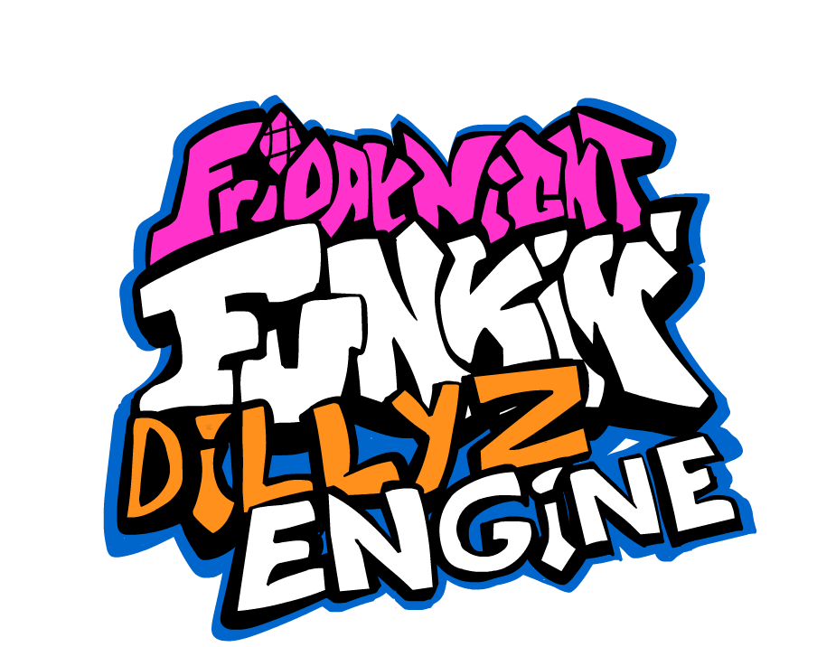

  

  An organized recreation of Friday Night Funkin' by <a href="https://www.github.com/DillyzThe1">DillyzThe1</a>. 
  (Made all the programming & custom art or animation not seen in the original game)

  Original game (of which the source code was unused) can be found on <a href="https://github.com/ninjamuffin99/Funkin">NinjaMuffin99</a>'s Github. 
  The original artist and animators of the game consists of <a href="https://twitter.com/phantomarcade3k">Phantom Arcade</a> & <a href="https://twitter.com/evilsk8r">EvilSk8r</a>. 
  The original musician of the game was <a href="https://twitter.com/kawaisprite">KawaiSprite</a>.

# Friday Night Funkin': Dillyz Engine
  
Ah, the classic FNF rhythm game! What terrible programing! 
That's why I've personally gone out of my way to open a new HaxeFlixel project and make it from scratch! 
Well, for the programming and custom art/animation atleast. 
The original music and Adobe Animate project files were taken from the original game, but the FLA files were modified heavily.
<b><i>Note: Do not attempt to port this to anything not on Mac, Linux, or Windows.</i></b> 
<b><i>Also, you may not use any custom assets or programming from the repository unless you are making a mod in/of the engine or have my permission.</i></b>  
<b><i>You may reference the source code, though. I don't care as long as you add credit.</i></b> 

## How To Play
<s>Download the latest release from <a href="https://gamebanana.com/wips/69825">GameBanana</a> by using the <a href="https://www.youtube.com/watch?v=dQw4w9WgXcQ">Google Drive</a> link.</s> 
<i>NOTE: Not actually released on any other website</i> 
If you're not on windows, then you may actually wanna check the <a href="https://github.com/DillyzThe1/FNF-Dillyz-Engine/actions">Actions</a> page for a release, however, it may be a pre-release. 
Extract the zip or whatever & open the exe. 
<i>Note: You may or may not get a warning for the software considering I do not sign my software, but just allow it through the firewall by hitting show more. If you don't trust me, read the source code.</i> 

## Modding
### For Mods Folder
First off, go into the folder where you extracted the game. 
Open the mods folder and clone _TEMPLATE. 
Rename the mod accordingly. 
Now, edit modIcon.png by adding your icon or mod logo and hue shifting the bg. 
<i>Note: You can now edit ANY in-game asset by simply placing something of the same name and directory in the mod folder. 
 Also, directories such as assets/shared/images and assets/images are merged into mods/yourModNameHere/images as shared is basically an alt.</i> 
 To add your character to the game, go to the main menu and go to the "Dev" option. 
 From here, you want to select "Add/Modify Character" and wait for it to load. 
 Now, type your spritesheet location in the top input of the Characters section and hit reload.  
 Pick the side you want, and use the following keybinds for quicker movement: 
 - W/A/S/D: Temporary Camera Movement
 - Q/E: Temporary Camera Zooming
 - ONE: Go to PlayState.
 - TWO: Go back to MainMenuState.
 - FOUR: Reload animation information.
 - THREE: Refresh the character. (Also views PlayState camera position)
 - SPACE: Restart Animation.
 - LEFT/DOWN/UP/RIGHT: (Animation Tab) Offset animation. (Character Tab) Offset character.
 - COMMA: Go back one animation.
 - PERIOD: Go foward one animation.
 
 Hit the Save JSON button and put it in mods/yourModNameHere/characters 
 Finally, load a chart with your character.
### For Source Code
 If you're on windows, install <a href="https://haxe.org/download/version/4.2.4/">HaxeFlixel 4.2.4</a> (via the installer). 
 Next, clone my repository downloading the source code by hitting Code > Download ZIP (as you should use forks for pull requests). 
 (Windows) Extract the zip somewhere & run setup.bat  
 (Other) Extract the zip somewhere & install the following haxelibs: flixel, flixel-addons, & flixel-ui. 
 Open the source code folder in Visual Studio Code and start programming! 
 Oh, and run build.bat to compile.

# Credits
## Dillyz Engine
### Main Team
* <a href="https://github.com/DillyzThe1">DillyzThe1<a/> - Programming, Custom Art, & Custom Animation
### Contributors
* <a href="https://github.com/Impostor5878">Impostor5875<a/> - Created getSpr() in FunkyLuaManager.hx
### Special Thanks
* <a href="https://github.com/AlekEagle">AlekEagle<a/> - Submitted <a href="https://github.com/ninjamuffin99/Funkin/issues/625#issuecomment-805200377">a comment on an issue at NinjaMuffin99/Funkin<a/> that solved my linux builds.
## Sourced Repositories
### Programming
* <a href="https://github.com/ninjamuffin99/Funkin">NinjaMuffin99/Funkin<a/> - Original Rythm Code (Song.hx, Section.hx, Conductor.hx)
* <a href="https://github.com/ShadowMario/FNF-PsychEngine/">ShadowMario/FNF-Psych-Engine<a/> - Lua implementation I based mine off of.
* <a href="https://github.com/gedehari/IzzyEngine">Gedehari/Izzy-Engine<a/> - Original Crash Handler (although mine is still wip)
* <a href="https://github.com/KadeDev/Kade-Engine">KadeDev/Kade-Engine<a/> - I attempted to use some commits to fix linux builds, which failed, but I'm still giving credit.
### Assets (Unedited)
* <a href="https://github.com/ninjamuffin99/Funkin">NinjaMuffin99/Funkin<a/> - The art folder & songs folder contain everything that was modified in some way here.
## Friday Night Funkin' Original Assets
### Original Programming
* <a href="https://github.com/ninjamuffin99">NinjaMuffin99<a/> - Created the mess of a haxe project called FNF. The source code is almost entirely unused in this engine.
### Original Art/Animation
* <a href="https://twitter.com/phantomarcade3k">PhantomArcade<a/> - Created most of the art & animation seen in the original game
* <a href="https://twitter.com/evilsk8r">EvilSk8r<a/> - Created some of the art for the original game
### Original Music
* <a href="https://twitter.com/kawaisprite">KawaiSprite<a/> - Created all of the original music.
